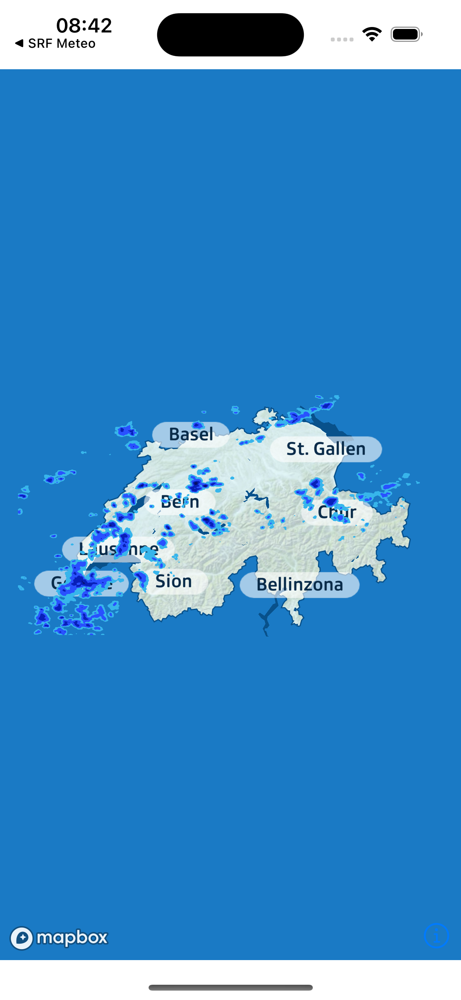
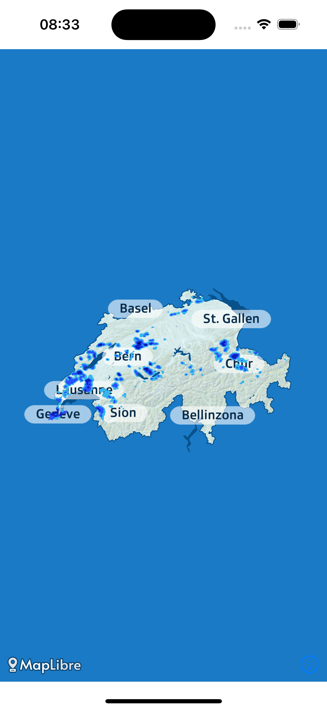
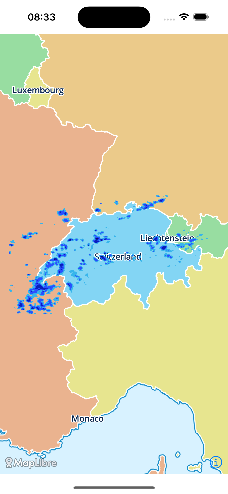

# mapLibreMaskBug
This repo contains a simple iOS (SwiftUI) Demo App showcasing a bug in the current MapLibre Package v6.2.0.

## Bug description
This demo app sets a custom style to the MapView, which contains a mask to cut out Switzerland and mask all other countries. It then adds an ImageLayer on top of the map (to show precipitation data). This ImageLayer should not be cut/masked outside of Switzerland. This worked fine with the latest major release of MapLibre v5:

However, when updating to MapLibre v6.2, we noticed that the ImageLayer gets cut/masked outside of Switzerland:

When not applying any custom style, the ImageLayer is correctly displayed:

## How to reproduce

Build and run the app on an iOS Simulator from XCode 15.3. The ImageLayer wil get cut/masked outside of Switzerland ❌

### How to reproduce correct behaviour with MapLibre v5

1. Change package dependency rule to use MapLibre v5
2. Replace 'import MapLibre' with 'import MapBox'
3. Search for all occurences of "MLN" and replace it with "MGL"
4. Build and run the app on an iOS Simulator with iOS 17.3 or older (since MapLibre v5 crashes on iOS 17.4 when built with XCode 15.3)
